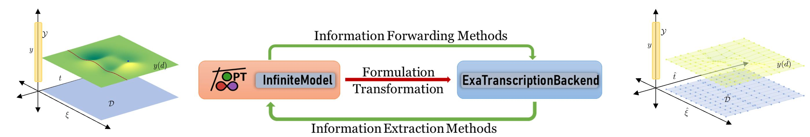

# InfiniteExaModels.jl
This package provides a transformation backend for [InfiniteOpt](https://github.com/infiniteopt/InfiniteOpt.jl)
such that InfiniteOpt models are efficiently transformed into [ExaModels](https://github.com/exanauts/ExaModels.jl)
via automated direct transcription. The underlying ExaModels models leverage recurrent algebraic structure to 
facilitate accelerated solution on CPUs and GPUs (up to two orders-of-magnitude faster).
Moreover, InfiniteOpt provides an intuitive interface that automates transcription and drastically reduced 
model creation time relative to solving JuMP models via ExaModels' `Optimizer` interface.



## Status
[](https://github.com/infiniteopt/InfiniteExaModels.jl/actions/workflows/ci.yml) [](https://codecov.io/github/infiniteopt/InfiniteExaModels.jl?branch=main)

InfiniteExaModels is tested on Windows, MacOS, and Linux on Julia's LTS and the latest release.

## Installation
InfiniteExaModels is a registered Julia package and is installed like any other:
```julia
using Pkg
Pkg.add("InfiniteExaModels")
```

## Usage
InfiniteExaModels primarily provides `ExaTranscriptionBackend` which can be passed to an `InfiniteModel` along
with a solver that is compliant with [JuliaSmoothOptimizers](https://github.com/JuliaSmoothOptimizers) standards.

### CPU Usage
Typical CPU workflows will use [Ipopt](https://github.com/JuliaSmoothOptimizers/NLPModelsIpopt.jl):
```julia
using InfiniteOpt, InfiniteExaModels, NLPModelsIpopt

model = InfiniteModel(ExaTranscriptionBackend(IpoptSolver))
```

### GPU Usage
Typical GPU workflows will use [MadNLP](https://github.com/MadNLP/MadNLP.jl), [CUDA](https://github.com/JuliaGPU/CUDA.jl]), 
and [CUDss](https://github.com/exanauts/CUDSS.jl) (a compatible Nvidia GPU is required):
```julia
using InfiniteOpt, InfiniteExaModels, MadNLP, CUDA # be sure to install CUDSS first as well

model = InfiniteModel(ExaTranscriptionBackend(MadNLPSolver, backend = CUDABackend()))
```

## Citation
If this is useful for your work please consider citing it:
```latex
@article{Gondosiswanto2025advances,
  title = {Advances to modeling and solving infinite-dimensional optimization problems in InfiniteOpt.jl},
  journal = {Digital Chemical Engineering},
  volume = {15},
  pages = {100236},
  year = {2025},
  issn = {2772-5081},
  doi = {https://doi.org/10.1016/j.dche.2025.100236},
  url = {https://www.sciencedirect.com/science/article/pii/S2772508125000201},
  author = {Evelyn Gondosiswanto and Joshua L. Pulsipher},
}
```
The article is freely available [here](https://doi.org/10.1016/j.dche.2025.100236).
