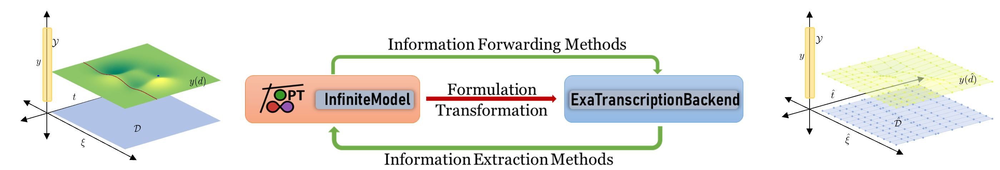

# InfiniteExaModels.jl
This package provides a transformation backend for [InfiniteOpt](https://github.com/infiniteopt/InfiniteOpt.jl)
such that InfiniteOpt models are efficiently transformed into [ExaModels](https://github.com/exanauts/ExaModels.jl)
via automated direct transcription. The underlying ExaModels models leverage recurrent algebraic structure to 
facilitate accelerated solution on CPUs and GPUs (up to two orders-of-magnitude faster).
Moreover, InfiniteOpt provides an intuitive interface that automates transcription and drastically reduced 
model creation time relative to solving JuMP models via ExaModels' `Optimizer` interface.



## Status
[](https://github.com/infiniteopt/InfiniteExaModels.jl/actions/workflows/ci.yml) [](https://codecov.io/github/infiniteopt/InfiniteExaModels.jl?branch=main)

InfiniteExaModels is tested on Windows, MacOS, and Linux on Julia's LTS and the latest release.

## Installation
InfiniteExaModels is a registered Julia package and is installed like any other:
```julia
using Pkg
Pkg.add("InfiniteExaModels")
```

## Usage
InfiniteExaModels primarily provides `ExaTranscriptionBackend` which can be passed to an `InfiniteModel` along
with a solver that is compliant with [JuliaSmoothOptimizers](https://github.com/JuliaSmoothOptimizers) standards.

### CPU Usage
Typical CPU workflows will use [Ipopt](https://github.com/JuliaSmoothOptimizers/NLPModelsIpopt.jl):
```julia
using InfiniteOpt, InfiniteExaModels, NLPModelsIpopt

model = InfiniteModel(ExaTranscriptionBackend(IpoptSolver))
```

### GPU Usage
Typical GPU workflows will use [MadNLP](https://github.com/MadNLP/MadNLP.jl), [CUDA](https://github.com/JuliaGPU/CUDA.jl]), 
and [CUDss](https://github.com/exanauts/CUDSS.jl) (a compatible Nvidia GPU is required):
```julia
using InfiniteOpt, InfiniteExaModels, MadNLP, CUDA # be sure to install CUDSS first as well

model = InfiniteModel(ExaTranscriptionBackend(MadNLPSolver, backend = CUDABackend()))
```

### Supported Formulations and Performance Recommendations
InfiniteExaModels supports continuous nonlinear programs with scalar constraints (i.e., no vector constraints).
Since InfiniteExaModels works by automatically recognizing repeated algebraic patterns in `InfiniteModel`s to 
setup an `ExaModel` which is efficient with a modest number of recognized patterns that each are not large. As
such, performance can signficantly degrade or a stack overflow may occur when certain patterns are not recongnized.
Best practice is to do the following:
- Define objectives with nonlinear terms inside of measures (e.g., integrals) (e.g., avoid forms like `sin(z) * integral(y, t)`, do `integral(sin(z) * y, t)` instead)
- For nested measures in objectives, locate the expression in the innermost measure (e.g., avoid forms like `integral(y * integral(q, x), t)`, do `integral(integral( y * q, x), t)` instead)
- If you need to measure many terms in an objective, use the form `integral(sum(@force_nonlinear(my_expr)), t)` (i.e., use a measure of a sum of nonlinear terms, avoid a sum of measures `sum(integral(my_expr))`)
- Avoid having measures or large sums in constraints
- Avoid having constraints or objetives that iterate/sum over a large collection of infinite parameters
If you have a compelling use case that cannot work with the above conditions, please let us know by opening an issue and we will see what we can do.
To understand how your the `ExaModel` is being built, use `print_build_info = true`:
```julia
optimize!(model, print_build_info = true)
```

## Citation
If this is useful for your work please consider citing it:
```latex
@article{Gondosiswanto2025advances,
  title = {Advances to modeling and solving infinite-dimensional optimization problems in InfiniteOpt.jl},
  journal = {Digital Chemical Engineering},
  volume = {15},
  pages = {100236},
  year = {2025},
  issn = {2772-5081},
  doi = {https://doi.org/10.1016/j.dche.2025.100236},
  url = {https://www.sciencedirect.com/science/article/pii/S2772508125000201},
  author = {Evelyn Gondosiswanto and Joshua L. Pulsipher},
}
```
The article is freely available [here](https://doi.org/10.1016/j.dche.2025.100236).
